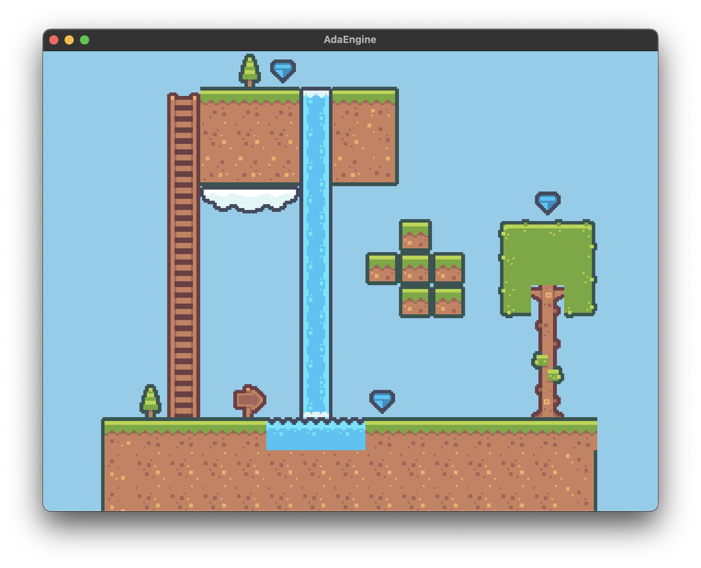

<p align="center">
  <a href="https://adaengine.github.io">
    
  </a>
</p>

[](https://github.com/AdaEngine/AdaEngine/blob/main/LICENSE)
[](https://swiftpackageindex.com/AdaEngine/AdaEngine)
[](https://swiftpackageindex.com/AdaEngine/AdaEngine)


## What is AdaEngine?

AdaEngine is a game engine fully written on Swift. The main idea is to encourage Swift developers to use this game engine to create fast and impressive games and user interfaces using Swift as their main language. We hope that AdaEngine can become as popular in the GameDev community as Rust and C# are.

<p align="center">
  <a href="https://adaengine.github.io">
    
  </a>

  <a href="https://adaengine.github.io">
    
  </a>
</p>

## Design Goals

* **Capable:** Offer a complete 2D feature set.
* **ECS:** AdaEngine is based on the data-oriented paradigm using a self-written ECS. The AdaEngine has been inspired by Apple's RealityKit framework.
* **Simple:** AdaEngine is easy to use, and our main goal is to enable a quick start and deliver quick results.

## 📕 Docs

* **[API Docs](https://adaengine.org/adaengine-docs/documentation/adaengine/):** AdaEngine's API docs, which are automatically generated from the doc comments in this repo.
* **[Tutorials](https://adaengine.github.io/adaengine-docs/tutorials/adaengine/)**: AdaEngine's offical tutorials with how to start your first project.

## ⭐️ Examples

* **[AdaEngine Awesome Projects](https://github.com/AdaEngine/AdaEngineAwesome)**: AdaEngine's offical Awesome Projects page. Feel free to explore.

## Getting started

We recommend checking out the **[Create your first project guide](https://adaengine.github.io/adaengine-docs/tutorials/adaengine/createproject)** for a brief introduction.

To draw a plain window with standard functionality use:

```swift
import AdaEngine

@main
struct AdaEditorApp: App {

    var scene: some AppScene {
        GUIAppScene {
            Window()
        }
        .windowMode(.windowed)
        .windowTitle("AdaEngine")
    }
}
```

## 👥 Community

If you want to discuss this library or have a question about how to use it to solve a particular
problem, there are a number of places you can discuss with fellow

  * For long-form discussions, we recommend the
    [discussions](http://github.com/AdaEngine/AdaEngine/discussions) tab of this
    repo.

## 👨‍💻 Contributing to AdaEngine

You are welcome to contribute to AdaEngine. Currently, it is under development, and we are working towards our roadmap goals. If you find a bug or have some improvements, we would be glad to see your pull request!

## 🛠️ How to build

Currently we use Bazel and Swift Package Manager as build tools. 

#### Swift Package Manager

Use Xcode 16.3 or Visual Studio Code with the [Swift VSCode Extension](https://www.swift.org/blog/vscode-extension/) and then open `Package.swift` file from the root directory. 

#### Bazel 

Bazel optional build system for project. To build project for development download [Bazelisk](https://github.com/bazelbuild/bazelisk). To generate xcproject, use `bazel run generate_xcproj` command in terminal. 

> [!IMPORTANT]
>
> **For Xcode**
> To build project with vulkan, add `VULKAN_SDK` environment path to `Xcode -> Settings -> Locations -> Custom Paths`, where path must be locate to Vulkan SDK.
>
> **For Other**
> By default Bazel and SwiftPM will search Vulkan SDK in your environment variables, set `export VULKAN_SDK = /User/username/VULKAN_SDK` in your env variables or in your terminal file `.zshrc`, `.bashprofile`, etc.
